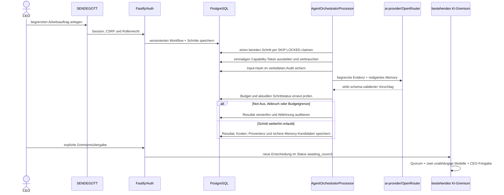

# Sichere Agenten-Orchestrierung

Stand: 22. Juli 2026

`packages/agent-orchestrator` erweitert SENDEGOTT um kontrollierte Multi-Agent-Workflows. Die Orchestrierung ist
standardmäßig gestoppt und vollständig vom Broadcast-Runner entkoppelt. Ein Agent erstellt ausschließlich belegte
Analysen und Vorschläge. Er kann weder OBS steuern noch Dateien schreiben, Shell-Befehle ausführen, Git bedienen,
Secrets lesen, Medien veröffentlichen oder Änderungen anwenden.

## Rollen

| Rolle                                 | Anzeigename | Aufgabe                                                                 | Harte Obergrenze                                          |
| ------------------------------------- | ----------- | ----------------------------------------------------------------------- | --------------------------------------------------------- |
| Self-Improvement-Engineer             | Nora        | Repository- und Betriebsanalyse, Test-, Risiko- und Rollback-Vorschläge | Nur lesender Index und `propose:code-change`              |
| Growth & Analytics Agent              | Leo         | Reale Kennzahlen, Programmvielfalt und überprüfbare Wachstumshypothesen | Keine erfundene Reichweite, keine manipulativen Maßnahmen |
| Dynamic Content Producer / Clip-Maker | Kian        | Format-, Produktions- und Clip-Entwürfe aus freigegebenem Bestand       | Kein Rendern, Schalten oder Publizieren                   |

Die Rollen-Capabilities sind sowohl im Package als auch serverseitig fest begrenzt. Eine UI- oder API-Anfrage kann
keiner Rolle eine Capability außerhalb dieser Grenze geben.

## Kontrollfluss



Der letzte Workflow-Schritt bereitet nur ein Übergabepaket vor. Erst der separate CEO-Klick **An Gremium übergeben**
erzeugt eine bestehende `autonomous_studio_decision`. Für Self-Improvement steht darin verbindlich
`proposal-only-no-code-execution`. Der nachgelagerte Gremiums-, Review-, CEO-, Apply- und Rollback-Pfad bleibt die
einzige Autorität.

## Capabilities und Tokens

- Grants gelten nur für Workflow, Schritt, Rolle und genau eine Capability.
- Das zufällige Token wird nur einmal an den Worker zurückgegeben; PostgreSQL speichert ausschließlich SHA-256.
- Ein Grant ist einmal verwendbar, zeitlich begrenzt und besitzt ein eigenes Kostenlimit.
- Rate Limit, Workflow-Budget und globales UTC-Tagesbudget werden unter Datenbanksperren geprüft.
- Der globale Not-Aus widerruft offene Grants und blockiert laufende Schritte. Bereits laufende Modellantworten werden
  nach ihrer Rückkehr verworfen und nicht ins Memory übernommen.
- Tool-Aufrufe bilden eine SHA-256-Kette. Trigger verhindern Update und Delete des Auditjournals.

## Memory und RAG

Das Langzeit-Memory liegt in PostgreSQL. Auf der aktuellen Installation ist `pgvector` nicht verfügbar; deshalb wird
der deterministische, lokal lauffähige Volltextmodus `fts-simple-v1` verwendet. Diese Retrieval-Version steht an jedem
Memory-Eintrag und ermöglicht eine spätere kontrollierte Neuindizierung. Es gibt keine harte Vector- oder Cloud-
Abhängigkeit.

RAG kann ausschließlich folgende begrenzte Quellen lesen:

- redaktionelle Sicherheitsleitlinien und freigegebene Dokumentation;
- aggregierte Studiometriken;
- Kanalverlauf, Sendungen, Formate und bestehende Gremiumsentscheidungen;
- einen Dateinamen-/Package-Index des Repositorys ohne Secrets und ohne Quellcodeausführung;
- Ergebnisse bereits abgeschlossener Schritte desselben Workflows.

Web-, Chat-, Video- und Transkriptinhalt gilt als nicht vertrauenswürdig. Injection-Muster werden markiert; Secrets
werden vor Speicherung redigiert. Fakten-Memory wird nur aus vertrauenswürdiger Evidenz übernommen. Aufbewahrung,
Maximalzahl, Aktivierung und Löschung sind unter **KI Studio → SENDEGOTT → Regeln/Memory** steuerbar. Löschung ist
logisch; das append-only Zugriffsjournal bleibt für die Revision erhalten.

## Betriebsmodi

- `stopped`: Standard und Not-Aus. Keine neuen Agentenschritte und keine inhaltliche Memory-Aktualisierung.
- `running`: Ein bis vier konfigurierte Workflows können kontrolliert bearbeitet werden.
- `draining`: Keine neuen Claims; laufende Schritte werden beendet, danach wechselt der Modus zu `stopped`.

`safe_broadcast_mode=true` sowie die Konsistenz von `enabled` und `mode` sind Datenbank-Constraints und können weder
im Browser noch über die API abgeschaltet werden. Agentenfehler werden im Störungscenter protokolliert, der
Broadcast-Runner wird davon nicht angehalten.

## API

| Methode    | Route                                           | Recht                                                        | Zweck                                                   |
| ---------- | ----------------------------------------------- | ------------------------------------------------------------ | ------------------------------------------------------- |
| GET        | `/api/agent-orchestrator`                       | angemeldet                                                   | Status, Rollen, Workflows, Kosten und Audit             |
| GET        | `/api/agent-orchestrator/templates`             | angemeldet                                                   | versionierte Workflow-Vorlagen                          |
| GET        | `/api/agent-orchestrator/workflows/:id`         | angemeldet                                                   | Schritte, Resultate, Grants, Audit und Memory           |
| POST       | `/api/agent-orchestrator/workflows`             | `broadcast:write`; Self-Improvement zusätzlich `users:write` | Arbeitsauftrag anlegen                                  |
| POST       | `/api/agent-orchestrator/workflows/:id/handoff` | `users:write`                                                | explizite Übergabe an das bestehende Gremium            |
| POST       | `/api/agent-orchestrator/control`               | `users:write`                                                | Start, Drain oder Not-Aus                               |
| PATCH      | `/api/agent-orchestrator/settings`              | `users:write`                                                | Budget, Parallelität und Memory-Grenzen                 |
| PATCH      | `/api/agent-orchestrator/agents/:id`            | `users:write`                                                | Rolle innerhalb harter Capability-Grenzen konfigurieren |
| GET/DELETE | `/api/agent-orchestrator/memories[/:id]`        | `users:write`                                                | Memory prüfen oder logisch löschen                      |

## Diagnose

```bash
npm run db:migrate
npm run studio:preflight -- --scope=api
systemctl --user status obs-live-studio-worker.service
journalctl --user -u obs-live-studio-worker.service --since today
```

Die Vorabprüfung kontrolliert Schema, Broadcast-Isolation, append-only Trigger, Rollen, veraltete Claims und
Tagesbudget. Ein absichtlich gestoppter Orchestrator wird als **deaktiviert**, nicht als Studiostörung gemeldet.

## Bewusste Phase-1-Grenze

Es existiert noch keine Sandbox für Patches, kein Git-Gateway und kein autonomer OBS-/Publish-Zugriff. Diese Werkzeuge
werden erst in Phase 2 beziehungsweise 3 hinter zusätzlichen Freigaben eingeführt. Bis dahin ist jeder technische
Agentenoutput ein nicht ausführbarer Entwurf.
