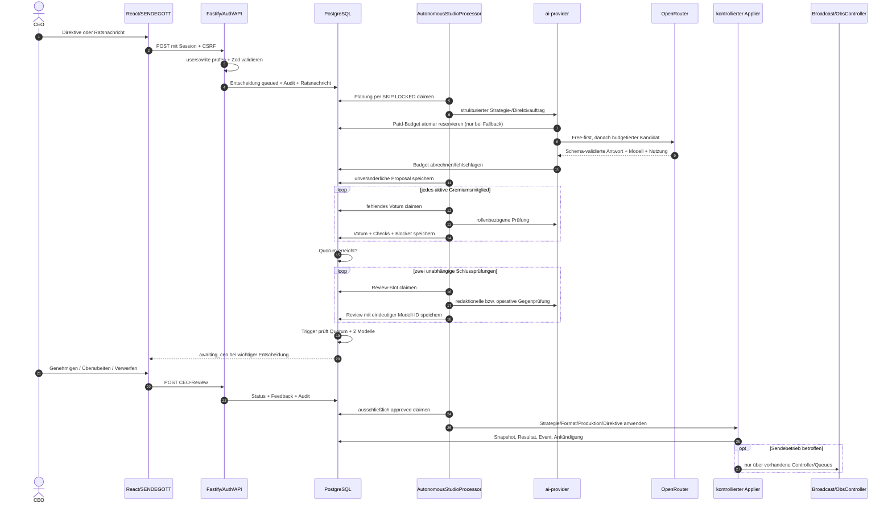
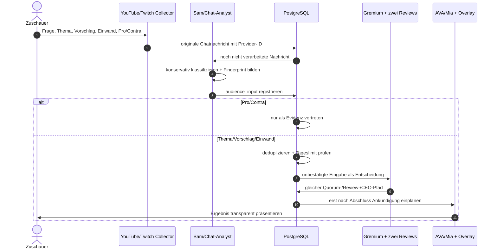
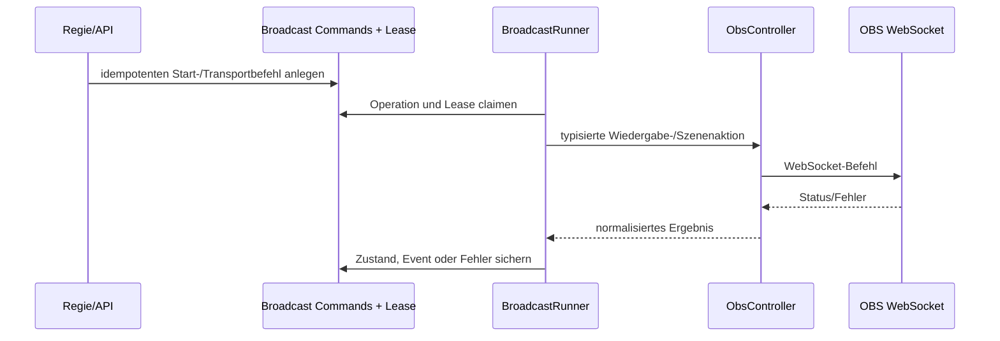

# Architektur des autonomen Sendergremiums

Stand: 22. Juli 2026

Dieses Dokument beschreibt den tatsächlich vorhandenen Kontrollfluss vor dem Ausbau von `packages/agent-orchestrator`.
Es ist der Sicherheitsvertrag für alle folgenden Phasen. Die Datenbank ist die Quelle der Wahrheit; weder ein
Modelltext noch ein Browserzustand darf eine produktive Aktion autorisieren.

## Systemgrenzen

| Bereich | Prozess/Package | Verantwortung | Darf nicht |
| --- | --- | --- | --- |
| Bedienung | `apps/web` | CEO-Zentrale, Vorschau, Freigaben und Diagnose | OBS, Git oder Shell direkt ansprechen |
| HTTP-Grenze | `apps/api` | Fastify, Auth, CSRF, Zod, Rollenrechte, Audit und sichere Downloads | Modellantworten als Berechtigung behandeln |
| Orchestrierung heute | `apps/worker/src/autonomous-studio.ts` | Entscheidungen planen, Voten/Reviews einzeln claimen, freigegebene Änderungen anwenden | Quorum, CEO-Freigabe oder Budget umgehen |
| KI-Zugang | `packages/ai-provider` | Aufgabenrichtlinien, Structured Outputs, Free-first/Paid-Fallback und Modellwahl | Secrets an den Browser geben oder Budget selbst erfinden |
| Zustandsführung | `packages/database` / PostgreSQL | Locks, Zustandsautomaten, Quorum, Freeze-Trigger, Budgetreservierungen und Auditdaten | ungeprüfte Zustandsübergänge akzeptieren |
| Sendebetrieb | `apps/broadcast-runner` + `packages/obs-controller` | lease-basierte Wiedergabe und ausschließlich gekapselte OBS-Kommandos | Entscheidungen oder Chattext interpretieren |
| Präsentation | AI-Team, TTS und Overlays | freigegebene Beschlüsse durch AVA/Mia präsentieren | eine Ausspielung freigeben oder Code ausführen |
| Betrieb | systemd User Services | Restart, Healthchecks und getrennte Prozesse | Anwendungsfreigaben ersetzen |

## Rollen und Identitäten

### Menschliche Rollen

| Rolle | Rechte im aktuellen RBAC | Bedeutung für das Gremium |
| --- | --- | --- |
| `administrator` | alle fünf Schreibrechte | CEO-Direktiven, Gremiumskonfiguration, wichtige Freigaben und Rollback |
| `redaktion` | Quellen, Artikel, Broadcast und OBS schreiben | Sendebetrieb und redaktionelle Arbeit; keine Benutzer-/Gremiumsverwaltung |
| `nur_lesen` | keine Schreibrechte | reine Beobachtung |

Die fünf vorhandenen Schreibrechte sind `sources:write`, `articles:write`, `broadcast:write`, `obs:write` und
`users:write`. Sie sind für autonome Werkzeuge zu grob. Phase 1 führt deshalb separate, kurzlebige
Agent-Capabilities ein; Agenten erben niemals die Rolle eines angemeldeten Benutzers.

### Bestehendes Senderteam

- Producer: Produktionsaufträge und Ablaufpläne.
- Redaktion: Themen, Nachrichtentexte und redaktionelle Bearbeitung.
- Faktenprüfung: Quellen- und Gegenbelegprüfung.
- Sam, Chat-Analyst: Chat sammeln, klassifizieren und deduplizieren.
- AVA: Einordnung und Präsentation.
- Mia, Chat-Moderatorin: Zuschauerfragen und Chatzusammenfassungen.

### Bestehendes KI-Sendergremium

1. Redaktionelle Vorsitzende (`editorial-chair`)
2. Publikumsanwalt (`audience-advocate`)
3. Produktionsdirektorin (`production-director`)
4. Sicherheits- und Compliancebeauftragter (`safety-officer`)
5. Wachstumsstrategin (`growth-strategist`)

Mindestens das konfigurierte Quorum, derzeit drei von fünf, muss mit `approve` stimmen. Anschließend müssen zwei
weitere Reviews mit zwei tatsächlich unterschiedlichen Modellkennungen zustimmen.

## Entscheidungsfluss einer CEO-Direktive



Wichtige Eigenschaften:

- `FOR UPDATE SKIP LOCKED` und Zeitouts verhindern Doppelverarbeitung und stellen unterbrochene Arbeit wieder her.
- Ab dem ersten Votum friert `trg_freeze_reviewed_autonomous_studio_decision` Titel, Anweisung und Proposal ein.
- `trg_autonomous_studio_double_approval` blockiert `awaiting_ceo`, `approved`, `applying` und `applied`, wenn Quorum
  oder die zwei unabhängigen Reviews fehlen.
- Wichtige Strategie-, Format- und SENDEGOTT-Entscheidungen warten bei aktivierter Einstellung zusätzlich auf den CEO.
- Eine Überarbeitung ist eine neue, vollständig erneut zu prüfende Revision; alte Freigaben werden nicht übernommen.

## Publikumsfluss



Chattext ist ausschließlich Datenmaterial. Er darf weder Systemprompt, Toolname, Shellargument, URL-Ziel noch
SQL-Fragmente bestimmen. Ein Publikumsimpuls ist ausdrücklich keine Quelle.

## Sendebetrieb und OBS



Das autonome Gremium spricht OBS nicht direkt an. Formate verändern Datenbank-/Autopilotkonfiguration; der
Broadcast-Runner bleibt die einzige 24/7-Wiedergabeinstanz. Der Live-Bereich verwendet denselben `ObsController`.
Manuelle Sicherheitswege sind Stream Stop, Broadcast Stop und Rückkehr zur Wartungsszene. Ein einheitlicher
agentenweiter Not-Aus mit Capability-Widerruf ist eine verbindliche Phase-1-Lücke.

## Zustände und Freigaben

```text
queued -> planning -> awaiting_council -> awaiting_reviews
                                      -> revise/rejected
awaiting_reviews -> awaiting_ceo -> approved -> applying -> applied
                 -> revise/rejected
applied -> rolled_back
Fehlerpfad: nichtterminale Zustände -> failed -> retry/revision
```

Wichtige Entscheidungen: `importance=high|critical` und `require_ceo_approval=true`.
Nur `status=approved` und `automatic_apply=true` sind claimbar. Der Datenbanktrigger kontrolliert den Übergang erneut,
auch wenn ein fehlerhafter Client die Anwendung direkt versuchen würde.

## Dateninventar

| Gruppe | Tabellen |
| --- | --- |
| Gremium | `autonomous_studio_settings`, `autonomous_studio_decisions`, `autonomous_studio_council_members`, `autonomous_studio_council_votes`, `autonomous_studio_reviews` |
| Nachvollziehbarkeit | `autonomous_studio_events`, `autonomous_studio_council_messages`, `autonomous_studio_deliverables`, `audit_logs` |
| Publikum/Präsentation | `autonomous_studio_audience_inputs`, `autonomous_studio_announcements`, `ai_host_chat_messages`, `ai_host_sessions`, `ai_staff_turns` |
| Mitarbeiter | `ai_staff_members`, `ai_staff_tasks`, `ai_staff_activity` |
| Strategie | `studio_operating_state`, `broadcast_templates`, `broadcast_playlists`, Autopilot-Systemeinstellung |
| Kosten | `openrouter_usage_events` |
| Betrieb | `broadcast_commands`, `broadcast_runner_leases`, `live_events`, `notifications` |

## Budget- und Modellregeln

- `openrouter/free` wird zuerst versucht.
- Paid-Fallback ist pro Aufgabe und speziell für Präsentierende abschaltbar.
- PostgreSQL reserviert das maximale Einzelbudget unter einem tagesbezogenen Advisory Lock.
- Abrechnung, unsichere Kosten, Blockierungen und Fehler bleiben als Usage Event erhalten.
- Modellkandidaten müssen Structured Outputs beherrschen und unter der Preisobergrenze liegen.
- Gremiumsrollen und Schlussprüfungen nutzen denselben zentralen Provider, aber getrennte Aufträge.
- Die beiden Schlussprüfungen besitzen eine Unique-Constraint auf `(decision_id, reviewer_model)` und eine zusätzliche
  Laufzeitprüfung gegen bereits verwendete Modellkennungen.

## Wiederanlauf und Rücknahme

- Veraltete Planning-, Council- und Review-Locks werden zeitbegrenzt erneut claimbar.
- Workerfehler erzeugen deduplizierte Einträge im Störungscenter und stoppen Broadcast/Autopilot nicht.
- Rollback stellt gespeicherten Operating-State, Autopilot und Mitarbeiterkonfiguration wieder her; neu erzeugte
  Formate/Overlays werden archiviert und Produktionsaufträge abgebrochen.
- Aktive Kindentscheidungen müssen vor ihrer Elternentscheidung zurückgenommen werden.
- Der Broadcast-Runner besitzt eine eigene Lease, Recovery-Operationen und OBS-Reconnect-Logik.

## Vor Phase 1 zu schließende Lücken

1. Fähigkeiten sind noch Rollen-/Prozesslogik statt kryptografisch gebundener, kurzlebiger Capability-Grants.
2. Es gibt kein zentrales unveränderliches Tool-Aufrufjournal mit Input-/Output-Hashes.
3. Repositoryanalyse und Codeausführung besitzen noch keine Sandbox und dürfen daher noch nicht agentisch laufen.
4. Das heutige `automatic_apply` ist global; Phase 1 benötigt getrennte Schalter je Risikoklasse und Werkzeug.
5. Stream Stop, Wartungsszene und Agentenpause sind noch kein atomarer Not-Aus.
6. Langzeit-Memory, Provenienz und Löschkonzept fehlen.
7. Wirkung und Qualität wurden bislang nicht zyklisch gegen eine gespeicherte Baseline bewertet.

Diese Punkte sind Freigabebedingungen und keine optionalen Optimierungen.
